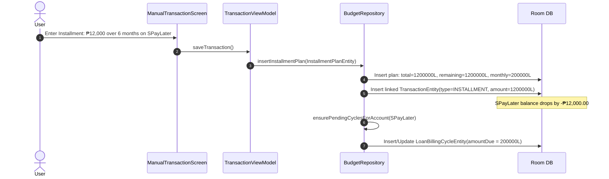
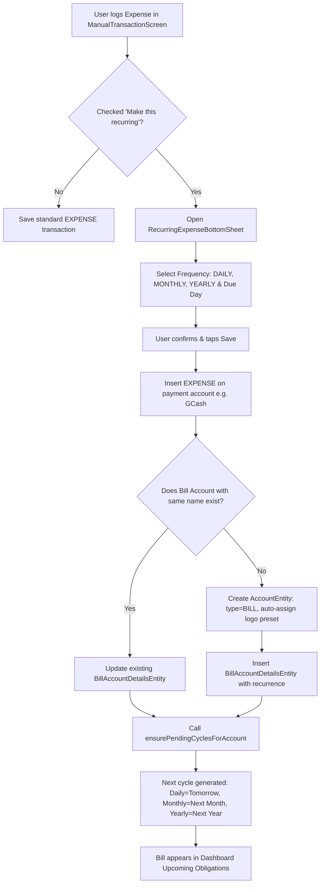
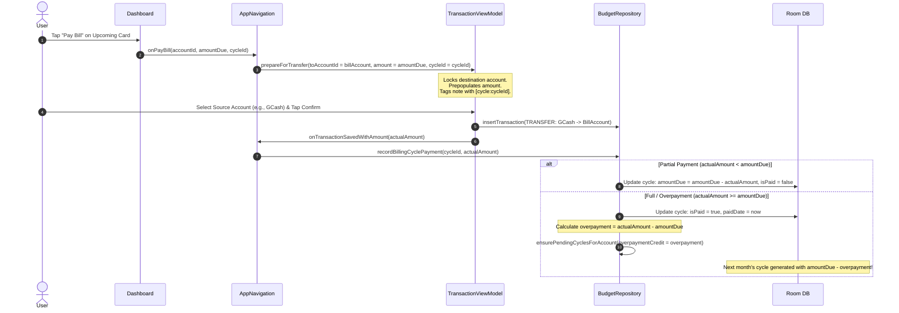
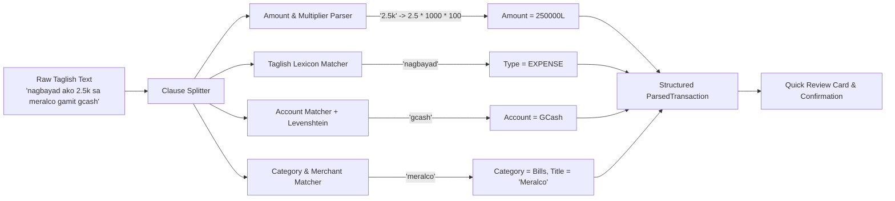

# Kwago Fintech Architecture & Complete Process Specification

> **App Version:** Latest Production Build (Database Schema v9)  
> **Platform:** Android (Kotlin, Jetpack Compose, Room SQLite, Unidirectional Data Flow)  
> **Currency Standard:** 100% Integer Centavos (`Long`, where `₱1.00 = 100L`)  
> **System Availability:** Fully Free (All account and transaction limits lifted)  
> **Last Updated:** 2026-10-06  

---

## 1. Executive Summary & Core Financial Foundations

Kwago is an **offline-first personal finance management and debt tracker** tailored specifically for the Philippine financial ecosystem (supporting GCash, Maya, ShopeePay, GrabPay, traditional banks like BDO/BPI/UnionBank/Metrobank/Landbank/RCBC, BNPL providers like SPayLater/LazPayLater/Atome/Home Credit/Billease/GLoan, and utility billers like Meralco/Maynilad/PLDT).

### Fundamental Financial Guarantees:
1. **Zero Floating-Point Drift:** All monetary arithmetic uses standard integer centavos (`Long`). Floating-point types (`Double`, `Float`) are forbidden for financial storage and ledger transactions, preventing IEEE 754 rounding errors.
2. **Pure Ledger Aggregation (No Mutated Account Balances):** Account balances are **never** stored as static, mutating columns. Instead, the current balance of any account is dynamically derived in real-time from the immutable ledger via SQLite reactive subqueries.
3. **Reversible, Auditable Double/Single Hybrid Ledger:** Every transaction—whether an expense, income, inter-account transfer, or debt amortization—is traceable. Deletions and edits gracefully roll back downstream billing cycles, installment plans, and loan balances.
4. **Local Sovereignty:** 100% functional without an internet connection or cloud dependency.
5. **Fully Free Tier:** All arbitrary account caps (e.g. 10-account limits) have been eliminated across the entire application.

---

## 2. Core Financial Taxonomy & Data Model

### 2.1 The 8 Account Types

```
                              AccountEntity
                                    │
         ┌──────────────────────────┴──────────────────────────┐
    Liquid Assets & Capital                               Liabilities & Bills
  (Positive Balance Normal)                           (Negative Balance Normal)
  ├── SAVINGS (Interest, Goals)                       ├── CREDIT (Credit Limit, Statement Day)
  ├── CASH (Physical currency)                        ├── LOAN (Min Due, Due Days, Reminders)
  ├── E_WALLET (GCash, Maya)                          ├── BNPL (Installments, Due Days)
  ├── BANK (Checking, Savings)                        └── BILL (Periodic cycles: Daily/Mo/Yr)
  └── ASSET (Property, Investments)
```

| Account Type | Classification | Normal Balance | `includeInNetWorth` | Attached Extension Entity |
| :--- | :--- | :--- | :--- | :--- |
| **SAVINGS** | Asset | $\ge 0$ (Deposit) | **Yes** (`true`) | `SavingsAccountDetailsEntity` (Interest rate, `goalAmount`, `targetDate`, `iconPreset`, `isGoal`) |
| **CASH** | Asset | $\ge 0$ (Physical) | **Yes** (`true`) | *None* |
| **E_WALLET** | Asset | $\ge 0$ (Stored Value)| **Yes** (`true`) | *None* |
| **BANK** | Asset | $\ge 0$ (Checking/Sav)| **Yes** (`true`) | *None* |
| **ASSET** | Asset | $\ge 0$ (Capital/Prop)| **Yes** (`true`) | `AccountEntity.assetTrend` (`GAINS_VALUE`, `LOSES_VALUE`, `NEUTRAL`) |
| **CREDIT** | Liability | $\le 0$ (Debt) | **Yes** (`true`) | `CreditAccountDetailsEntity` (Credit limit, Due day) |
| **LOAN** | Liability | $\le 0$ (Principal) | **Yes** (`true`) | `LoanAccountDetailsEntity` (Due days, Min due, Remaining) |
| **BNPL** | Liability | $\le 0$ (Installments)| **Yes** (`true`) | `LoanAccountDetailsEntity` (Linked installment plans) |
| **BILL** | Periodic Obligation | $0$ (Pass-through) | **No** (`false`) | `BillAccountDetailsEntity` (Recurrence: DAILY/MONTHLY/YEARLY) |

---

### 2.2 Live Account Balance Formula

An account’s live balance is aggregated dynamically in SQLite:

$$\text{CurrentBalance}(A) = \text{initialBalance} + \sum_{t \in \text{Transactions}} \Delta_t$$

$$\Delta_t = \begin{cases}
+t.\text{amount}, & \text{if } t.\text{type} = \text{INCOME} \land t.\text{accountId} = A \\
-t.\text{amount}, & \text{if } t.\text{type} = \text{EXPENSE} \land t.\text{accountId} = A \\
-t.\text{amount}, & \text{if } t.\text{type} = \text{TRANSFER} \land t.\text{accountId} = A \\
+t.\text{amount}, & \text{if } t.\text{type} = \text{TRANSFER} \land t.\text{toAccountId} = A \\
-t.\text{amount}, & \text{if } t.\text{type} = \text{INSTALLMENT} \land t.\text{accountId} = A \\
0, & \text{otherwise}
\end{cases}$$

### 2.3 Net Worth Computation

$$\text{NetWorth} = \sum_{a \in \text{Active Accounts} \land a.\text{includeInNetWorth} = 1} \text{CurrentBalance}(a)$$

---

## 3. The 12 End-to-End Fintech Backend Processes

```mermaid
flowchart TD
    subgraph Ingestion
        P1[1. Account Setup]
        P2[2. Manual Transaction & PEMDAS Numpad]
        P10[10. Taglish NLP Parser]
    end

    subgraph Core Ledger
        P3[3. Balance Adjustment]
        P8[8. Transaction Deletion & Reversals]
    end

    subgraph Liabilities & Obligations
        P4[4. Credit Card Cycle Engine]
        P5[5. BNPL & Installment Plans]
        P6[6. Recurring Expense to Bill Account]
        P9[9. Upcoming Obligations Engine]
    end

    subgraph Settlement & Intelligence
        P7[7. Bill & Loan Payment Settlement Flow]
        P11[11. Reports & Analytics Engine]
        P12[12. SQLite Migration & Integrity Engine]
    end

    P10 --> P2
    P2 --> Core Ledger
    P2 --> P5
    P2 --> P6
    P6 --> P9
    P4 --> P9
    P5 --> P9
    P9 --> P7
    P7 --> Core Ledger
    Core Ledger --> P11
```

---

### Process 1: Dynamic Account Balance Computation (Zero-Mutation Ledger Aggregation)

* **Trigger:** App startup, database observation, or any transaction write.
* **Component:** `AccountDao.kt` $\to$ `BudgetRepository.kt` $\to$ `StateFlow<List<AccountWithBalance>>`.
* **Execution Flow:**
  1. Room executes the SQL subquery:
     ```sql
     SELECT a.initialBalance + COALESCE((
         SELECT SUM(
             CASE 
                 WHEN t.type = 'INCOME' AND t.accountId = a.id THEN t.amount
                 WHEN t.type = 'EXPENSE' AND t.accountId = a.id THEN -t.amount
                 WHEN t.type = 'TRANSFER' AND t.accountId = a.id THEN -t.amount
                 WHEN t.type = 'TRANSFER' AND t.toAccountId = a.id THEN t.amount
                 WHEN t.type = 'INSTALLMENT' AND t.accountId = a.id THEN -t.amount
                 ELSE 0
             END
         )
         FROM transactions t
         WHERE t.accountId = a.id OR t.toAccountId = a.id
     ), 0)
     FROM accounts a
     WHERE a.isActive = 1
     ```
  2. Because SQLite triggers Room table updates on `transactions`, any insertion, modification, or deletion emits an updated `AccountWithBalance` object without requiring manual balance recalculation.
  3. Liabilities (Credit Card, Loan, BNPL) naturally display negative numbers representing outstanding debt.

---

### Process 2: Transaction Ingestion & In-Line Math Engine

* **Trigger:** User taps "Save Transaction" in `ManualTransactionScreen.kt`.
* **Execution Flow:**
  1. **Expression Evaluation:** If the user keyed in an expression like `1200 + 450 * 2`, `TransactionViewModel.evaluateExpressionString()` executes a two-pass token parser:
     - **Pass 1:** Evaluates all `*` (multiplication) and `/` (division) tokens.
     - **Pass 2:** Evaluates all `+` (addition) and `-` (subtraction) tokens with zero-division traps.
  2. **Validation:** Checks that `amount > 0L`, `accountId != null`, and if `type == TRANSFER`, ensures `toAccountId != null` and `toAccountId != accountId`.
  3. **Centavo Quantization:** User input string (e.g. `250.50`) is converted to exact centavos (`25050L`).
  4. **Persistence:**
     - If `INSTALLMENT`: Dispatches to `Process 5`.
     - If `EXPENSE` with `isRecurring = true`: Dispatches to `Process 6`.
     - Standard: Inserts `TransactionEntity` directly into SQLite.

---

### Process 3: Auditable Balance Reconciliation / Adjustment Flow

* **Trigger:** User taps "Adjust Balance" in `AccountDetailSheet.kt` to reconcile app balance with reality.
* **Financial Integrity Rule:** Kwago **never** overwrites the account’s `initialBalance` column, which would destroy historical audit trails.
* **Execution Flow:**
  1. Current calculated balance is compared to the entered physical balance:
     $$\text{Difference} = \text{NewPhysicalBalance} - \text{CurrentBalance}$$
  2. If $\text{Difference} > 0$: An explicit `TransactionEntity` is created with `type = INCOME`, `isAdjustment = true`, `category = "Adjustment"`, `amount = Difference`.
  3. If $\text{Difference} < 0$: An explicit `TransactionEntity` is created with `type = EXPENSE`, `isAdjustment = true`, `category = "Adjustment"`, `amount = |Difference|`.
  4. The adjustment is logged into the ledger, immediately reconciling the account balance to the exact centavo while preserving full accounting history.

---

### Process 4: Credit Card Cycle & Dynamic Statement Engine

* **Trigger:** Credit card expense logged, bill payment transferred, or daily cycle check.
* **Component:** `BudgetRepository.ensurePendingCyclesForAccount()`.
* **Execution Flow:**
  1. **Available Credit Formula:**
     $$\text{AvailableCredit} = \text{creditLimit} + \text{currentBalance}$$
     *(e.g., Credit Limit ₱50,000 + Current Balance -₱12,000 = ₱38,000 available).*
  2. **Advance / Overpayment Handling:** If a user pays more than what was owed, `currentBalance` becomes positive ($>0$). The UI automatically shifts label from *"What you owe"* to green `+₱X.XX` *"Credit balance"*, and suppresses billing cycle debt.
  3. **Auto-Adjusting Due Statements:** If a pending cycle exists and the user hasn’t set `isManualOverride = true`, as new expenses are added to the card, the pending cycle’s `amountDue` automatically synchronizes to `-currentBalance`.
  4. **Calendar Clamping:** Clamps the statement due day to the valid days of the current/next month (e.g., Day 31 clamped to 30 in April, 28/29 in February).

---

### Process 5: Buy Now Pay Later (BNPL) & Loan Installment Lifecycle



* **Execution Flow:**
  1. Creates an `InstallmentPlanEntity` storing `totalPurchaseAmount`, `totalInstallments`, `remainingBalance`, and `monthlyPaymentAmount = totalPurchaseAmount / totalInstallments`.
  2. Creates a paired `TransactionEntity` (`type = INSTALLMENT`, `installmentPlanId = plan.id`), deducting the entire liability from the account.
  3. Triggers `ensurePendingCyclesForAccount()`, which sets the upcoming billing cycle's `amountDue` to the sum of monthly payments across all active installment plans on that account.

---

### Process 6: Recurring Expense to Auto Bill Account Engine (Latest Feature)



* **Execution Flow:**
  1. **Current Transaction:** Recorded as an `EXPENSE` on the selected payment account (e.g. GCash), deducting balance today.
  2. **Deduplication Check:** Queries `getAllAccountsDirect()`. If an active `BILL` account with the same name already exists (case-insensitive), it updates the existing bill rather than polluting the accounts list with duplicates.
  3. **Preset Branding:** Detects Philippine utility names (e.g., "Meralco", "Maynilad", "PLDT") and auto-assigns official brand logos.
  4. **Recurrence Computation:**
     - `DAILY`: First upcoming cycle scheduled for tomorrow (`calculateNextDailyDueDate`).
     - `MONTHLY`: First upcoming cycle scheduled for next month on selected day (`calculateNextMonthlyDueDate`).
     - `YEARLY`: Stored as `month-day`, scheduled for next annual anniversary (`calculateNextYearlyDueDate`).

---

### Process 7: Bill & Loan Payment Settlement Workflow (The Pay Bill Flow)



* **Overpayment Carry-Forward:** When a user pays ₱2,000 on a ₱1,500 bill, the current cycle closes, and the next cycle is spawned with `amountDue = max(0, defaultDue - 500) = ₱1,000`.

---

### Process 8: Reversible Ledger & Auditability (Transaction Deletion & Edit Rollbacks)

* **Trigger:** User deletes or edits a transaction from History or Account Detail.
* **Component:** `BudgetRepository.deleteTransaction()` and `TransactionViewModel.saveTransaction(edit)`.
* **Execution Flow:**
  1. **Billing Cycle Reversal:**
     - Reads the `note` field for the `[cycle:ID]` stamp (or falls back to the most recent paid cycle for `toAccountId`).
     - Reverts the `LoanBillingCycleEntity`: sets `isPaid = false`, `paidDate = null`, restores `amountDue`, and restores `paidAmount`.
     - If linked to a loan, restores the `LoanAccountDetailsEntity.totalRemainingBalance`.
  2. **Installment Plan Reversal:**
     - If the original purchase transaction is deleted: deletes the entire `InstallmentPlanEntity`.
     - If a monthly installment payment transaction is deleted: decrements `installmentsPaid` by 1 and restores `remainingBalance += amount`.
  3. **Edit Re-Amortization:** If an installment purchase transaction amount is edited, the `InstallmentPlanEntity` recalculates `monthlyPaymentAmount = newTotal / totalInstallments` and updates `remainingBalance`.

---

### Process 9: Upcoming Obligations & Due Date Engine

* **Trigger:** Dashboard loading or state change.
* **Component:** `DashboardViewModel.upcomingObligations`.
* **Execution Flow:**
  1. **Reactive Merge:** Combines active pending billing cycles (`getAllPendingBillingCycles`), active account balances, and recurring bills.
  2. **Debt Suppression Filter:** If an account is debt-based (`LOAN`, `BNPL`, `CREDIT`) but its live balance is `0` or positive (card paid off), or the cycle due amount is `0`, the card is automatically suppressed from the dashboard.
  3. **Status Categorization:**
     $$\text{DaysUntilDue} = \text{dueDate} - \text{today}$$
     - $\text{DaysUntilDue} < 0 \implies \mathbf{OVERDUE}$ (Red banner)
     - $\text{DaysUntilDue} \in [0, 7] \implies \mathbf{DUE\_SOON}$ (Amber banner)
     - $\text{DaysUntilDue} > 7 \implies \mathbf{UPCOMING}$ (Zinc banner)

---

### Process 10: Taglish Smart NLP Parser Pipeline



* **Shorthand Multipliers:** Regex automatically detects `k`/`K` ($\times 1,000$) and `m`/`M` ($\times 1,000,000$).
* **Taglish Lexicon:** Supports Filipino financial verbs (`nagbayad`, `sweldo`, `inutang`, `hulugan`, `padala`, `bawas`, `ipon`, etc.).
* **Fuzzy Matching:** Levenshtein distance matches imperfect user-typed accounts against registered account names.

---

### Process 11: Reports & Financial Analytics Engine

* **Component:** `ReportsAnalyticsCalculator.kt` and `ReportsViewModel.kt`.
* **Analytics Capabilities:**
  1. **Crucial Accounting Integration:** Inter-account transfers to `BILL` accounts (`tx.type == TRANSFER && tx.toAccountId in billAccountIds`) are **dynamically treated as Expenses** in spending by category, top merchants, daily burn rate, and income vs expense totals.
  2. **Spending by Category:** Top 5–6 categories rendered in a custom **Muted Coral** palette; remaining categories grouped into `"Others"`.
  3. **Daily Burn Rate:**
     $$\text{BurnRate} = \frac{\text{Total Net Expenses in Period}}{\max(1, \text{Elapsed Days})}$$
  4. **Category Trends:** Tracks 4-month historical trendlines for leading spending categories.
  5. **Net Worth History:** Daily aggregated net worth trend over selected periods.

---

### Process 12: Database Schema & Migration Architecture (v1 to v9)

```
 v1 ──> v2 ──> v3 ──> v4 ──> v5 ──> v6 ──> v7 ──> v8 ──> v9 (Latest)
```

| Migration | Key Architectural Changes |
| :--- | :--- |
| **v1 $\to$ v2** | Added initial multi-account schema and index optimization. |
| **v2 $\to$ v3** | Added `loan_details`, `savings_account_details`, and `bill_account_details`. |
| **v3 $\to$ v4** | Added `loan_billing_cycles` for tracking statements and installments. |
| **v4 $\to$ v5** | Added `custom_categories` for personalized category hierarchies. |
| **v5 $\to$ v6** | Added `recurring_bills` table and `includeInNetWorth` account flags. |
| **v6 $\to$ v7** | Added `credit_account_details` and `isManualOverride` flag on billing cycles. |
| **v7 $\to$ v8** | Added `recurrence: TEXT NOT NULL DEFAULT 'MONTHLY'` to `bill_account_details`, supporting Daily, Monthly, and Yearly cycles with zero data loss. |
| **v8 $\to$ v9 (Latest)** | Added `budgets` table with unique index on `(category, period)`. Added `targetDate`, `iconPreset`, and `isGoal` to `savings_account_details` (modeling savings goals directly onto ledger accounts without mutating balances). Added manual `assetTrend` (`GAINS_VALUE`, `LOSES_VALUE`, `NEUTRAL`) to `accounts`. |

---

### Process 13: Budget Pacing & Daily Allowance Engine

* **Component:** `BudgetPaceCalculator.kt` (`com.example.budgettracker.domain`).
* **Design Principles:**
  1. **Strict Integer Arithmetic:** 100% integer centavos (`Long`). Zero Double/Float calculations for currency or pacing.
  2. **Goals-as-Accounts Architecture:** Savings goals are modeled as regular `SAVINGS` accounts with metadata on `SavingsAccountDetailsEntity` (`goalAmount`, `targetDate`, `iconPreset`, `isGoal`). Current goal progress is derived purely from dynamic ledger balance:
     $$\text{GoalProgress} = \frac{\text{CurrentDerivedBalance}}{\text{goalAmount}}$$
     Depositing to a goal is a standard `TRANSFER` into that account, ensuring edit/delete rollback works automatically with full reversibility.
  3. **Pace & Daily Allowance Formulas:**
     $$\text{DaysLeft} = \text{lengthOfMonth} - \text{dayOfMonth} + 1 \quad (\text{today inclusive})$$
     $$\text{LeftThisMonth} = \text{MonthlyBudget} - \text{SpentThisMonth}$$
     $$\text{DailyAllowance} = \left\lfloor \frac{\max(0, \text{LeftThisMonth})}{\text{DaysLeft}} \right\rfloor$$
     $$\text{RemainderCentavos} = \max(0, \text{LeftThisMonth}) \pmod{\text{DaysLeft}}$$
  4. **Spending Qualification Truth:** Shares spending qualification logic with `ReportsAnalyticsCalculator.isExpenseTransaction`:
     - Qualifies `EXPENSE` and `INSTALLMENT` transactions.
     - Qualifies `TRANSFER` transactions where `toAccountId` is a `BILL` account.
     - Excludes transfers between asset accounts and manual reconciliation adjustments (`isAdjustment = true`).
  5. **Category Budget Health:** Evaluates status per category:
     - `OVER`: $\text{spent} > \text{budget}$
     - `NEAR_LIMIT`: $\text{spent} \ge 80\% \times \text{budget}$
     - `OK`: $\text{spent} < 80\% \times \text{budget}$
  6. **Conservation of Spending:**
     $$\text{TotalSpent} \equiv \sum \text{CategorySpent} + \text{UncategorizedSpent}$$

---

---

## 4. Architectural Summary Table

| Dimension | Implementation |
| :--- | :--- |
| **Mathematical Precision** | Integer Centavos (`Long`), 0% IEEE 754 floating-point drift |
| **Ledger Design** | Hybrid single/double entry, non-mutated live subquery aggregation |
| **Debt & Liabilities** | Unified credit card statements, BNPL amortizations, and recurring bill cycles |
| **Reversibility** | Deletion hooks revert billing cycles and restore loan/plan balances |
| **Localization** | Taglish NLP parser, Philippine brand preset logos, Philippine billing conventions |
| **Commercial Model** | 100% Free and Uncapped (Account limits completely removed) |
