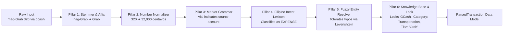
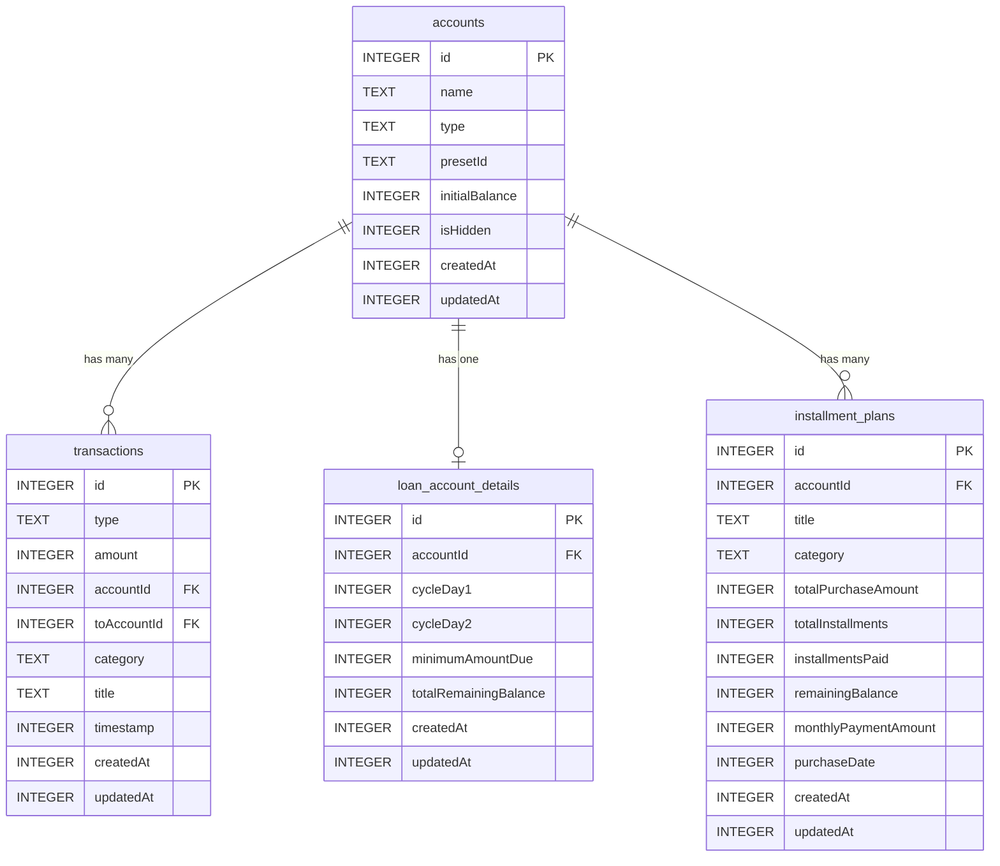

# "As-Is" System Architecture & Current System Baseline
**Application**: kwago (Personal Finance & Expense Manager)  
**Version**: `v1.3.0` (`versionCode = 4`)  
**Platform**: Android (Min SDK 26 / Target SDK 35+)  
**UI Toolkit**: Jetpack Compose (Material Design 3)  
**Language**: 100% Kotlin  
**Persistence**: Offline-First Local SQLite via AndroidX Room  

---

## 1. Architectural Philosophy & Core Invariants

BudgetTracker is architected around four non-negotiable operational principles:

1. **100% Offline-First & Privacy-By-Design**:
   - **Zero Network Permissions**: The `AndroidManifest.xml` declares no `android.permission.INTERNET`. No network calls, telemetry, remote crashes, or analytics can leave the device.
   - **Zero Cloud Dependencies**: All data, backup operations, and parser intelligence reside strictly on the local filesystem.
2. **Zero Financial Precision Drift (Integer Centavos Representation)**:
   - All monetary calculations are stored and processed as integer 64-bit longs (`Long`) representing **Centavos** (e.g., `₱150.50` is stored as `15050L`). Floating-point arithmetic (`Double`/`Float`) is restricted strictly to visual UI formatting in [`CurrencyUtils.kt`](file:///d:/AndroidStudioProjects/BudgetTracker/app/src/main/java/com/example/budgettracker/util/CurrencyUtils.kt).
3. **Ultra-Lightweight & Sub-Millisecond Intelligence**:
   - No heavyweight LLMs or TFLite neural models.
   - Smart Parser intelligence is driven by a deterministic, zero-overhead in-memory slot-filling engine (<50KB bytecode footprint, <1ms execution latency, 0MB APK inflation).
4. **Unidirectional Data Flow (UDF)**:
   - UI emits user intent events $\rightarrow$ ViewModels execute repository operations via Kotlin Coroutines $\rightarrow$ Room DAOs emit reactive `StateFlow` streams $\rightarrow$ UI recomposes automatically.

---

## 2. High-Level System Architecture

```mermaid
graph TD
    subgraph UI_Layer ["Presentation Layer (Jetpack Compose)"]
        MainActivity["MainActivity (Single Activity Host)"]
        NavHost["AppNavigation (NavHost)"]
        
        DashboardScreen["DashboardScreen<br/>(NetWorthCard, AccountSlider, QuickActions)"]
        AccountsScreen["AccountsScreen<br/>(Grouped Accounts, InlineAddCard, Modals)"]
        ManualTxScreen["ManualTransactionScreen<br/>(Numpad, TypeToggle, Form)"]
        QuickParseScreen["QuickParseScreen<br/>(Voice/Text Input, Chips, PreviewCard)"]
        TxHistoryScreen["TransactionHistoryScreen<br/>(Filtering, Grouping, Search)"]
        SettingsScreen["SettingsScreen<br/>(Theme, Backup/Restore, Glossary, About)"]
    end

    subgraph ViewModel_Layer ["State Management & ViewModels (MVVM)"]
        DashboardVM["DashboardViewModel"]
        QuickParseVM["QuickParseViewModel"]
        TxVM["TransactionViewModel"]
        TxHistoryVM["TransactionHistoryViewModel"]
        ThemePrefs["ThemePreferences"]
    end

    subgraph Parser_Subsystem ["NLP & Smart Parser Subsystem (6-Pillar Engine)"]
        SingleTxParser["SingleTransactionParser"]
        TaglishLexicon["TaglishLexicon<br/>(Affixes, Numerals, Markers, Verbs)"]
        CategoryDict["CategoryDictionary<br/>(PH Brand/Slang Mapping)"]
        Levenshtein["LevenshteinMatcher<br/>(O(N*M) Fuzzy Typo Guard)"]
        BatchParser["BatchAccountSetupParser<br/>(Multi-Account Onboarding)"]
        Presets["PhilippinePresets<br/>(16+ Brand Catalog)"]
        ParserUtils["ParserUtils<br/>(Regex Tokenizer & Amounts)"]
    end

    subgraph Domain_Repository ["Repository Layer"]
        BudgetRepo["BudgetRepository (Single Source of Truth)"]
    end

    subgraph Data_Storage ["Persistence & Storage Layer (Room SQLite)"]
        AppDb["AppDatabase (Room Database v1)"]
        AccountDao["AccountDao"]
        TxDao["TransactionDao"]
        LoanDao["LoanDetailsDao"]
        InstallmentDao["InstallmentPlanDao"]
        BackupMgr["BackupManager (JSON Serialization)"]
        CsvExp["CsvExporter"]
    end

    %% UI -> ViewModel Wiring
    DashboardScreen --> DashboardVM
    QuickParseScreen --> QuickParseVM
    ManualTxScreen --> TxVM
    TxHistoryScreen --> TxHistoryVM
    SettingsScreen --> ThemePrefs
    SettingsScreen --> BackupMgr

    %% ViewModel -> Repository
    DashboardVM --> BudgetRepo
    QuickParseVM --> BudgetRepo
    TxVM --> BudgetRepo
    TxHistoryVM --> BudgetRepo

    %% Parser Interactivity
    QuickParseVM --> SingleTxParser
    QuickParseVM --> BatchParser
    SingleTxParser --> TaglishLexicon
    SingleTxParser --> CategoryDict
    SingleTxParser --> Levenshtein
    SingleTxParser --> Presets
    SingleTxParser --> ParserUtils

    %% Repository -> DAOs
    BudgetRepo --> AccountDao
    BudgetRepo --> TxDao
    BudgetRepo --> LoanDao
    BudgetRepo --> InstallmentDao

    %% DAOs -> Database
    AccountDao --> AppDb
    TxDao --> AppDb
    LoanDao --> AppDb
    InstallmentDao --> AppDb
    BackupMgr --> BudgetRepo
```

---

## 3. Subsystem Breakdown

### 3.1 Presentation & UI Layer
- **Jetpack Compose + Material 3**: Design system centered around soft zinc corners (`10.dp`), explicit color tokens (`Green500`, `Orange500`, `Red500`, `SurfaceVariant`), and custom responsive layouts.
- **Single Activity Architecture**: [`MainActivity.kt`](file:///d:/AndroidStudioProjects/BudgetTracker/app/src/main/java/com/example/budgettracker/MainActivity.kt) sets the content, observes theme preferences, and hosts [`AppNavigation.kt`](file:///d:/AndroidStudioProjects/BudgetTracker/app/src/main/java/com/example/budgettracker/ui/navigation/AppNavigation.kt).
- **Navigation Graph Routes**:
  - `Screen.Dashboard` ("dashboard"): Overview of net worth, account cards, recent transactions.
  - `Screen.Accounts` ("accounts"): Account management, visibility toggles, "+ Add Account" modal trigger.
  - `Screen.ManualTransaction` ("manual_transaction"): Direct entry with slide-up calculator keyboard.
  - `Screen.QuickParse` ("quick_parse"): Conversational and dictation financial parser.
  - `Screen.TransactionHistory` ("history"): Filterable ledger with time grouping.
  - `Screen.Settings` ("settings"): Theme switching, JSON backup/restore, glossary.
- **Custom Modular Dialogs**:
  - [`AddEditAccountDialog.kt`](file:///d:/AndroidStudioProjects/BudgetTracker/app/src/main/java/com/example/budgettracker/ui/account/AddEditAccountDialog.kt): 2-step preset grid + detail form with category tabs (`Savings`, `E-Wallet`, `Loan/BNPL`, `Bill`, `Other`) and Philippine brand logos.
  - [`SharedModals.kt`](file:///d:/AndroidStudioProjects/BudgetTracker/app/src/main/java/com/example/budgettracker/ui/components/SharedModals.kt): 6 standardized center dialogs (Balance Adjustment, Theme Picker, Math Guard, Account Limit, Delete Block, Delete Confirmation).
  - [`SingleTransactionPreviewCard.kt`](file:///d:/AndroidStudioProjects/BudgetTracker/app/src/main/java/com/example/budgettracker/ui/parse/components/SingleTransactionPreviewCard.kt): Interactive confirmation card for parser review with title editing, installment duration selection, and transfer routing.

---

### 3.2 The 6-Pillar Taglish Semantic Engine

The core intelligence powering the Smart Parser converts unstructured, slang-filled Filipino/English text and keyboard voice dictation into strict database entities.

1. **Pillar 1: Morphological Stemmer & Affix Stripper ([`TaglishLexicon.kt`](file:///d:/AndroidStudioProjects/BudgetTracker/app/src/main/java/com/example/budgettracker/parser/TaglishLexicon.kt))**:
   - Detects and strips common Tagalog verbalizing prefixes (`nag-`, `nagpa-`, `mag-`, `pina-`, `nang-`, `pag-`) attached to merchants or verbs (e.g. `"nag-Grab"` $\rightarrow$ `"Grab"`, `"nagpa-gas"` $\rightarrow$ `"gas"`).
2. **Pillar 2: Number & Currency Normalizer ([`ParserUtils.kt`](file:///d:/AndroidStudioProjects/BudgetTracker/app/src/main/java/com/example/budgettracker/parser/ParserUtils.kt))**:
   - Parses currency symbols (`₱`, `PHP`), multiplier suffixes (`35k` $\rightarrow$ `35,000.00`), Tagalog numerals (`isang libo`, `limang daan`), and installment rates (`3500/mo 6 months` $\rightarrow$ `21,000.00` total).
   - Uses strict word boundaries and lookahead guards to prevent device model identifiers (`s24`, `iphone15`) from colliding with amounts.
3. **Pillar 3: Semantic Case Marker Grammar**:
   - Parses prepositional roles:
     - Payment markers: `gamit ang`, `gamit`, `via`, `thru`, `using`, `galing sa` $\rightarrow$ Source Account.
     - Destination markers: `papunta sa`, `to`, `send to`, `patungo sa` $\rightarrow$ Destination Account.
     - Beneficiary/Merchant markers: `para kay`, `kay`, `kina`, `sa` $\rightarrow$ Recipient/Merchant.
4. **Pillar 4: Filipino Intent Lexicon**:
   - Categorizes financial direction without external classifiers:
     - `INCOME`: `sahod`, `sweldo`, `received`, `natanggap`, `freelance`, `bonus`, `ayuda`, `deposit`.
     - `TRANSFER`: `lipat`, `nilipat`, `transfer`, `pasa`, `padala`, `forward`.
     - `INSTALLMENT`: `hulugan`, `buwan-buwan`, `spaylater`, `lazpaylater`, `billease`, `/mo`.
     - `EXPENSE`: `bayad`, `nagbayad`, `bili`, `gastos`, `kinain`, `ambag`.
5. **Pillar 5: Fuzzy Entity Resolver ([`LevenshteinMatcher.kt`](file:///d:/AndroidStudioProjects/BudgetTracker/app/src/main/java/com/example/budgettracker/parser/LevenshteinMatcher.kt))**:
   - Tolerates acoustic voice dictation errors (`"gecash"` $\rightarrow$ `"GCash"`, `"jolibee"` $\rightarrow$ `"Jollibee"`).
   - Features a **strict acronym collision guard**: tokens $\le 3$ characters (e.g. `BDO`, `BPI`) require distance 0, preventing acronym collisions.
6. **Pillar 6: Knowledge Base & Canonical Account Lock**:
   - Matched accounts are locked strictly to canonical catalog names (`GCash`, `Maya`, `BPI`), eradicating naming bugs like `"GCash that"`.
   - Residual title synthesizer strips filler pronouns and grammatical particles while retaining contextual phrases (e.g. `"Dinner 450 with Sarah GCash"` $\rightarrow$ Title: `"Dinner With Sarah"`).

---

### 3.3 Data Layer & Persistence Architecture

#### Room Database Schema ([`Entities.kt`](file:///d:/AndroidStudioProjects/BudgetTracker/app/src/main/java/com/example/budgettracker/data/local/entity/Entities.kt))

#### DAOs & Reactive Flows
- **[`AccountDao.kt`](file:///d:/AndroidStudioProjects/BudgetTracker/app/src/main/java/com/example/budgettracker/data/local/dao/AccountDao.kt)**: Returns `Flow<List<AccountEntity>>` for active/hidden accounts. Calculates aggregate balance by querying initial balances + transaction sums.
- **[`TransactionDao.kt`](file:///d:/AndroidStudioProjects/BudgetTracker/app/src/main/java/com/example/budgettracker/data/local/dao/TransactionDao.kt)**: CRUD queries for transactions, time-window queries, and account-specific ledger streams.
- **[`InstallmentPlanDao.kt`](file:///d:/AndroidStudioProjects/BudgetTracker/app/src/main/java/com/example/budgettracker/data/local/dao/InstallmentPlanDao.kt)**: Tracks BNPL schedules, remaining balances, and payment increments.
- **[`LoanDetailsDao.kt`](file:///d:/AndroidStudioProjects/BudgetTracker/app/src/main/java/com/example/budgettracker/data/local/dao/LoanDetailsDao.kt)**: Manages credit card and loan billing cycles (cutoff and due days).

#### Backup & Data Portability
- **[`BackupManager.kt`](file:///d:/AndroidStudioProjects/BudgetTracker/app/src/main/java/com/example/budgettracker/data/backup/BackupManager.kt)**:
  - Generates atomic JSON backup payloads containing complete schemas (Accounts, Transactions, Loans, Installments) with a schema version header.
  - Implements transactional restore: clears existing tables and restores backup data inside a single atomic Room transaction.
- **[`CsvExporter.kt`](file:///d:/AndroidStudioProjects/BudgetTracker/app/src/main/java/com/example/budgettracker/data/export/CsvExporter.kt)**:
  - Exports transactions into standardized CSV format for external spreadsheet tools.

---

## 4. Current System Baseline Summary Table

| System Property | Current Baseline Specification |
| :--- | :--- |
| **App Version** | `1.1.0` (`versionCode = 2`) |
| **Architecture Pattern** | MVVM + Unidirectional Data Flow (UDF) + Repository Pattern |
| **Target SDK / Min SDK** | Target SDK 35 / Min SDK 26 (Android 8.0+) |
| **Network Footprint** | **0 bytes** (No `INTERNET` permission declared) |
| **Binary Size** | ~20MB APK (Zero bundled heavy ML models) |
| **Monetary Storage** | 64-bit integer Centavos (`Long`) |
| **NLP Subsystem** | 6-Pillar Taglish Semantic Engine (100% On-Device Kotlin) |
| **Supported Brands** | 16+ Philippine Banks, E-Wallets, BNPLs, and Utility Providers |
| **Test Coverage** | 145 Unit & Robolectric Tests passing (100% success rate) |
